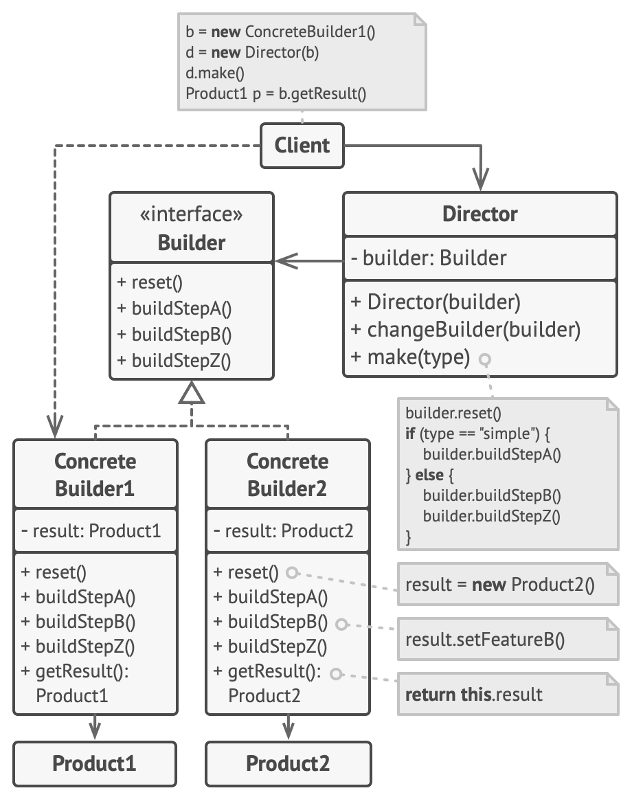

# DESIGN PATTERNS

---

## Introduzione

* Soluzioni a problemi comuni e ricorrenti
* Frutto di esperienza e processo induttivo
* Standardizzazione
* Generalità / astrazione
* Primo anno citato di atoria: 1977 (-> induzione + esperienza)

---

## Introduzione (continua...)

_Un pattern descrive il nucleo di una soluzione relativa un problema che compare
frequentemente in un dato contesto_

_Il modello della soluzione deve essere strutturato in modo che
“si possa usare tale soluzione un milione di volte, senza mai farlo allo stesso modo”_

Christopher Alexander (architetto)

---

## Macro categorie di pattern

Le principali categorie di pattern sw sono:

* Architetturali (es. client server, MVC)
* Progettuali ("via di mezzo", i "nostri")
* Idiomi (basso livello, legati al linguaggio, es. il Singleton)

---

## Classificazione dei pattern

| Creazionali            | Strutturali           |Comportamentali         |
| ---                    | ---                   |---                     |
| Factory method         | Adapter               |Interpreter             |
| Abstract Factory       | Bridge                |Template Method         |
| Builder                | Composite             |Chain of Responsability |
| Prototype              | Decorator             |Command                 |
| Singleton              | Facade                |Iterator                |
|                        | Flyweigh              |Mediator                |
|                        | Proxy                 |Memento                 |
|                        |                       |Observer                |
|                        |                       |State                   |
|                        |                       |Strategy                |
|                        |                       |Visitor                 |

---

## Frequenza d'uso dei pattern

---

## Scelta dei pattern presentati

Utilizzati due criteri:

* Popolarità
    In base alla classifica di frequenza d'uso

* Uso effettivo
    Cioè che più probabilmente si implementa nel normale
    nel normale lavoro di tutti i giorni (es. template method)
    a differenza di altri (es. Observer) che più facilmente si
    trovano già implementati in librerie e framework

---

## Gli altri

A richiesta in "Puntate" successive...

---

## Leitmotiv

Nei pattern (creazionali in primis, ma tutti) si notano
due fondamentali linee guida:

* Chiamate polimorfiche di metodi
* Utilizzo degli oggetti attraverso le loro interfacce

---

## Factory / struttura

Si vuole creare un'interfaccia per la creazione di oggetti il
cui tipo non è noto a priori, ma la sua interfaccia lo è.

---

## Factory / Esempio

Un convertitore di gradi Celsius Fahrenheit può prendere
l'input o da file, o da terminale

Si vuole razionalizzare l'istanziazione della classe che preleva l'input

Utile quando non si conosce a runtime la tipologia di oggetto da creare

---

## Abstract Factory / Struttura

Abstract Factory serve per creare famiglie di
oggetti consistenti tra loro

---

## Abstract Factory / Esempio

Si vuole costruire gli elementi "grafici" di una
home page multilingue, costituita da un messaggio
di benvenuto ed una bandiera.

Si vuole garantire che il "set" bandiera / messaggio
sia coerente

Si sceglie una "dimensione" che gestirà gli artfetti dello stesso
tipo a lei coerenti.

---

## Builder / Struttura

Lo scopo del builder è incapsulare la costruzione di un oggetto complesso

---

## Builder / Esempio

Costruire una classe Logger composta di un formatter e di
uno "scrittore" di output.

Secondo il formatter o il tipo do output scelto, si hanno diversi tipi
di logger, che vanno costruiti a step.
